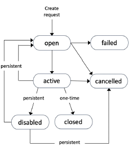

### EC2 - Elastic Compute Cloud

#### Introduction

- Compute services on EC2 :
    - Renting virtual machines (EC2)
    - Storing data on virtual drives (EBS)
    - Distributing load across machines (ELB)
    - Scaling the services using an auto-scaling group (ASG)
- Bootstrap EC2 instances using an EC2 User data script (only 1 time on first boot)
- Sizing - Instance types (ex. t2.micro)

#### Creating EC2 Instance

- Name and tags
- Select Base image (Amazon Machine Image) from Catalog (ex. Amazon Linux 2 AMI)
- + Choose architecture
- Instance type : size and performances (t2.micro is Free tiers eligible)
    - https://aws.amazon.com/ec2/instance-types/
    - m5.2xlarge (m = class; 5 = generation; 2xlarge = size)
    - General purpose => t classes
    - Compute optimized => c classes
    - Memory Optimized (Cache stores, In mem db; databases; real time processing; etc.) => R classes, x1, etc.
    - Storage Optimized => (I, D, H classes)
- Create RSA (or other) Key pair for SSH access
- Security Group (Network rules - ex Allow HTTP and SSH traffic)
- Storage Config
    - Size
    - Delete on termination
    - Etc.
- User data : shell script launched on first machine boot
- States : Pending - Running
- Stopping / Starting (Public IP may change) / Terminating
- Note : stopped instances = no billing

#### Security Groups

- Kind of virtual firewalls
- Security groups only contain "Allow" rules
- Security groups rules can reference by IP or by security group
- 1 EC2 instance may have Many Security groups
- By default : All inbound is blocked and all outbound is authorized
- Regulates
    - Access to ports
    - Authorized IP Ranges
    - Inbound Network
    - Outbound Network
- SG can be attached to multiple instances
- Locked down to region/VPC combination
- Known ports :
    - 22 SSH and SFTP
    - 21 FTP
    - 3389 RDP (Remote Desktop Protocol / Windows)
- Note : Timeout errors are always due to SG
- SSH connection and PEM files
- EC2 Instance Connect (bash from Web)

#### Add role to instance

- Attach a Service Role to an instance 
- No more need to aws configure to access services allowed by role (having the good policies)

#### Purshasing Options

- AWS Pricing Calculator : calculator.aws
- On-Demand : short workload 
  - predictable pricing (Pay by second for Linux or Windows / per hours for others)
  - Good for : flexibility, short term, testing the water
- Reserved (1 or 3 years) - up to 72% discount
  - Good for : predictable usage, specific capacity requirements, 
  - Reserve a specific instance attributes (Instance Type, Region, Tenancy, OS)
  - Payment Options – No Upfront (+), Partial Upfront (++), All Upfront (+++)
  - Reserved Instance's Scope – Regional or Zonal (reserve capacity in an AZ)
  - You can buy and sell in the Reserved Instance Marketplace
  - Convertible reserved instances - up to 54% discount 
    - Can change the EC2 instance type, instance family, OS, scope and tenancy
  - Scheduled reserved instances : launch within a time window
- Savings Plans (1 or 3 years)
    - Get a discount based on long-term usage
    - Commit to a certain type of usage ($10/hour for 1 or 3 years)
    - Locked to a specific instance family & AWS region
    - Flexible across:
        - Instance Size (e.g., m5.xlarge, m5.2xlarge)
        - OS (e.g., Linux, Windows)
        - Tenancy (Host, Dedicated, Default)
- Spot Instances : short workload, cheap, less reliable (can lose instances)
    - Can get a discount of up to 90% compared to On-demand
    - Instances that you can "lose" at any point of time if your max price is less than the current spot price
    - Useful for workloads that are resilient to failure
        - Batch jobs
        - Data analysis
        - Image processing
        - Any distributed workloads
        - Workloads with a flexible start and end time
        - High performance computing 
        - CI/CD and testing 
        - Containerized Workloads 
- Dedicated Hosts : book an entire physical server, control instance placement
    - compliance requirements and use your existing server bound software licenses
    - /!\ exam : Special licensing requirements = Dedicated Hosts 
    - The most expensive option
    - Purchasing Options: On-demand or Reserved ( 1 or 3 years) with up to 70% off the on-demand price
- Dedicated Instances : no other customers will share your hardware
    - Instances run on hardware that's dedicated to you
    - May share hardware with other instances in same account
    - No control over instance placement  (can move hardware after Stop / Start)
- Capacity Reservations : reserve capacity in a specific AZ for any duration
    - No time commitment (create/cancel anytime), no billing discounts
    - Combine with Regional Reserved Instances and Savings Plans to benefit from billing discounts
    - You're charged at On-Demand rate whether you run instances or not
    - Suitable for short-term, uninterrupted workloads that needs to be in a  specific AZ

#### Spot instances

- Define max spot price and get the instance while current spot price < max
    - The hourly spot price varies based on offer and capacity
    - If the current spot price > your max price you can choose to stop or terminate your instance with a 2 minutes grace period.
- Spot Block :
    - "block" spot instance during a specified time frame (1 to 6 hours) without interruptions
    - In rare situations, the instance may be reclaimed
    - no longer supported since 31/12/22
- Spot Request :
    - Max price
    - Desired number of instances
    - Launch spec
    - Req Type : one-time | persistent
    - Valid from ; valid until
- Spot request states :

- You can only cancel Spot Instance requests that are open, active, or disabled.
- Cancelling a Spot Request does not terminate instances
- You must first cancel a Spot Request, and then terminate the associated Spot Instances

- Spot Fleets = set of Spot Instances + (optional) On-Demand Instances
    - The Spot Fleet will try to meet the target capacity with price constraints
    - Can have multiple launch pools, so that the fleet can choose
    - Define possible launch pools: instance type (m5.large), OS, Availability Zone
    - Spot Fleet stops launching instances when reaching capacity or max cost
    - Strategies to allocate Spot Instances:
        - lowestPrice (from the pool with lowest price)
        - diversified (availability) - get for different pools 
        - capacityOptimized
        - priceCapacityOptimized: pools with highest capacity available, then select  the pool with the lowest price
        - InstancePoolsToUseCount (in combination with lower price) : distribute across a nbr of specified pools

#### Public (default) IP vs Elastic IP

- All public IPs are charged by seconds
- EC2 default public IPs changes on stop/start
- Elastic IP : Fixed IP for EC2 instance
  - Up to 5 possible IPs
  - Try to avoid and use DNS

#### Placement Groups

- Control how EC2 instances are placed in infrastructure
- Only compute optimized, GPU, memory or storage optimized instances can be launched in a PG
- Stop existing instances to move them to a PG
- Strategies :
    - Cluster (Cluster instances into low latency group in a single AZ)
        - Same Rack (hardware) + same AZ => Great network vs failure risk
        - Use case : Big data; low latency apps
        - AWS recommends homogenous instances within cluster PG
    - Spread
        - Instances in difference hardware
        - Limit 7 instances by AZ by Placement Group
        - Scenario question: Individual instance (primary / secondary db for example)
    - Partition
        - Each partition = rack in AWS
        - Up to 7 partitions per AZ
        - Up to 100s of EC2 instances
        - Use case : Bigdata that are partition aware (like HDFS)
        - Scenario questions : Multiple instances 

#### Elastic Network Interface (ENI)

- ENI = Virtual Network Card
    - Primary IPv4 and one or more secondary ones
    - One Elastic IPv4 per private IPv4
    - One Public IPv4
    - One or more SG
    - A MAC Address
    - ...
- ENI are bound to AZ
- ENI can be created independently
- Can attach an ENI to an EC2 instance; detach it and move it to another instance
- Helpful for failover

#### Enhanced Networking (EN)

- Single root I/O Virtualization to provide high performance 
- 10 Gbps - 100 Gbps
- Depending on instance type
  - Elastic Network Adapter (ENA) up to 100 Gbps
  - Intel 82599 Virtual Function (VF) Interface (10 Gbps used on older instances)
  - /!\ In the exam : Always choose ENA over VF

#### Elastic Fabric Adapter (EFA)

- Accelerates HPC (high performing computing) and machine learning apps 
- Lower and more consistent latency 
- Can use OS-BYPASS - lot faster with much lower latency 
  - For HPC and machine learning apps 
  - By passing OS and directly communicate with EFA Device 
  - Only linux support 

#### EC2 Hibernate

- Stop instance -> data on disk (EBS) kept
- Terminate instance -> data on disk (EBS volumes) are destroyed unless instructed not to
- Hibernate instance -> RAM is preserved
    - Faster boot time
    - RAM must be less than 150GB
    - Under the hood : use EBS Root volume (must be encrypted) to dump RAM
    - Use cases : Long running tasks ; saving ram sate; start time
    - Works on On demand, spot and reserved instances 

#### EC2 Metadata 

- curl to specific URL to get metadata from instance 
  - TOKEN = curl 
  - curl ... $TOKEN .../latest/meta-data/public-ipv4 for example 

#### vCenter in AWS 

- use cases 
  - Hybrid Cloud 
  - Cloud migration 
  - Disaster Recovery 
  - Leverage AWS 
- Runs on dedicated hardware 
- Each host has 2 sockets with 18 cores per socket, 512 GiB RAM & 15.2 TB Raw SSD Storage 
- Multiple VMware instances by host up to 100s
- Cluster can start with 2 hosts up to 16 hosts

#### AWS Outposts 

- AWS Data center on-premises 
- Large variety of AWS Service in private DC 
- Sizes : 1U to 42U racks and multi rack deployments 
- Use cases 
  - Hybrid Cloud 
  - Full managed (AWS can managed the infra for you)
  - Consistency with public AWS Services 
- Outposts Rack
  - starting with single 42U rack and scale up to 96 racks 
  - AWS compute, storage, database and other services 
- Outposts Servers 
  - Individual servers in 1U or 2U form factor 
  - Use cases : 
    - Small space requirements (retail stores, branch offices, healthcare provider locations, etc.)
    - Provide local compute and networking services 
- Process  
  - Order
  - Install (including, hardware, power, networking and connectivity)
  - Launch 
  - Build 