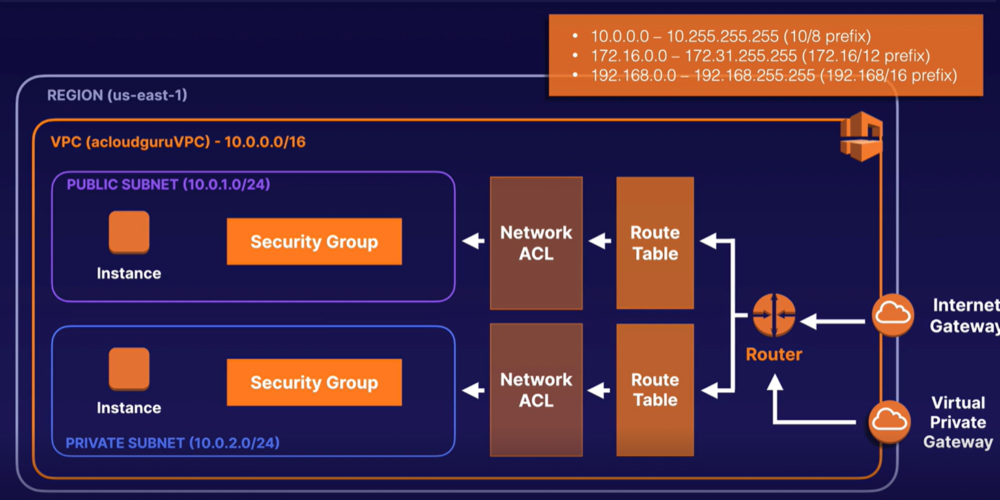

### VPC 

- Virtual Data Center in the Cloud / Fully customizable Network
- Logically isolated part of AWS Cloud where you can define your own network 
- Complete control of virtual network including :
  - Your own IP address range 
  - Subnets 
  - Route tables 
  - Network ACLs (NACL)
  - Network gateways 
  - Better instances and network security 
- Every region in every AWS account has default VPC
- Can create a Hardware VPN connection between on prem and VPC
  - AWS Cloud as extension to corporate DC
- When create a VPC  (ex. 10.0.0.0/16 => wide range )
  - Internet Gateway
  - Router 
  - Route table 
  - Network ACL 
  - Subnets (private / public) - (ex. 10.0.1.0/24, 10.0.2.0/24, etc.)
    - Route table and Network ACL configuration
    - SG, instances, etc.
  - /!\ by default it creates a Route table, a Network ACL and a Security Group  
- When creating a subnet in a VPC 
  - IP CIDR Block (ex. 10.0.1.0/24)
  - AZ 
  - Auto assign public IP addresses is by default "NO"
  - Note: the first 4 and the last address are AWS reserved (5 in all)
    - ex. 10.0.1.0 => Network address
    - ex. 10.0.1.1 => AWS VPC Router
    - ex. 10.0.1.3 => AWS DNS Server
    - ex. 10.0.1.4 => Future use 
    - ex. 10.0.1.255 => Network broadcast 

- /!\ Every subnet is in 1 AZ and cannot spread across AZs 
- /!\ IP addresses CIDR Block must be between /16 and /28 network mask 
  - Note CIDR = Classless Inter-Domain Routing for IP allocations 

- Default VPC vs Custom one 
  - Default is user friendly / Custom takes time to configure 
  - In default, all subnets have route out to internet 
  - In default, all instances have private and public IPs
- VPC Tenancy = default or dedicated (dedicated infrastructure)

#### Internet Gateway 

- Create a new Internet Gateway 
  - Attach it to a VPC (only custom VPC)
  - /!\ Cannot attach an Internet Gateway to the Default VPC
- Create new Route table to associated with Internet Gateway 
  - 0.0.0.0/0 destination 
  - Attach to Internet Gateway as target
  - Associate explicitly the public subnet to the route table 
    - This removes it from implicit association in the default Route table 
  - Note: default Route has local target 

#### NAT Gateway 

- Issue : Getting out internet access from private subnet instances 
- NAT => enables instances in private subnet to connect to internet 
         (or other AWS services) while preventing IN internet access
- NAT Gateway if provisioned in the public subnet to gain private ones access to internet 
- Caracteristics 
  - Redundant inside an AZ 
  - 5 Gbps and scales to 45 Gbps 
  - No need to patch 
  - Not associated with SG 
  - Auto assigned public IP
- Need to allocate an Elastic IP
- In the private route table add a route to NAT 
  - 0.0.0.0/0 destination (internet)
  - target = NAT Gateway created in the public subnet 
  - => now private instances have access to internet 

#### Network ACLs

- /!\ Note on SG : response of allowed inbound rules are allow to flow out regardless of outbound rules 
 (This is called stateful behaviour of SG in contrast with NACLs which are Stateless)
- NACL = Optional layer of security controlling traffic in/out a subnet 
- Rules can be similar to SG
- Default NACL for VPC allows are in/out traffic 
- Custom NACL = by default deny all in/out traffic 
- Each subnet must be associated with NACL / either custom or default one 
  - A Subnet can be associated with only one NACL (but same NACL can serve multiple Subnets)
- /!\ NACLs can block IP addresses but SG cannot 
- NACLs contain a numbered list of rules evaluated in order (starting from lowest 100 then 200 then 300 ...)
  - Inbound or Outbound rule
  - Each rule can either allow or deny 
  - They are stateless 
  - No rules by default 
- /!\ open ephemeral port 1024-65535 as outbound rule since web servers replies in custom ports
- Deny specific IP address
  - 23.24.25.26/32 as source
  - port 80
  - deny 
  - rule number = 50 (< 100) so it s evaluated first

#### VPC Endpoints 

- Connect VPC to AWS services without Internet Gateway or NAT
- Uses AWS Backbone network 
- No public IP required
- Horizontally scaled, redundant and highly available 
- No availability risk or network bandwidth constraints  
- 2 types 
  - Interface Endpoint 
    - Elastic network interface with private IP 
    - Large number of AWS Services 
  - Gateway Endpoint
    - Similar to NAT Gateway 
    - Virtual device 
    - Supports S3 and DynamoDB

#### VPC peering

- Multi VPC
- Direct networking with private IP 
- Instances behave as if it was same private network 
- Can peer VPC with other AWS Accounts 
- Peering are in star configuration 
- No transitive peering (A -> B and B -> C does not give A -> C - must be explicit)
- Can peer between regions 
- VPCs must have different CIDR address ranges 
- Opens all services between VPC

#### PrivateLink

- More restrictive than VPC 
- need Network load balancer on service VPC and ENI - Elastic Network Interface on consumer VPC
- Scales well (10s, 100s or 1000s of customers )

#### VPN CloudHub 

- Connect multiple sites each with their VPN connection 
- Hub and spoke model 
- Low cost 
- Operates over public internet with encrypted communication 

#### Direct connect 

- Connect On Premise DC with VPC 
- Reduce Network cost, increase bandwidth throughput and give more consistent network than with internet connection 
- 2 Types 
  - Dedicated connection : Physical ethernet connection
  - Hosted connected : Physical ethernet connection that AWS Direct CConnect partner provision on behalf of client
- Uses DX Location + AWS Cage with routers configuration in each 
- Fast, secure, reliable and take massive throughput compared to VPNs
- Can run VPN over a DX (Direct connection)

#### Transit Gateway 

- Simplifies the network topology 
- Allow to have transitive peering between 1000s of VPC and DX
- Hub and Spoke model 
- Regional but can be multi-region 
- Can be used across multiple AWS Accounts use RAM = Resource Access Manager 
- Support IP Multicast (not supported by other AWS Services)

#### 5G networks and AWS Wavelength 

- AWS Wavelength Embeds AWS Compute and store services in 5G Networks 
  - Mobile Edge computing infrastructure 

