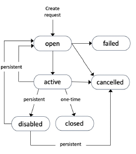

### EC2 - Elastic Compute Cloud

#### Preliminary : Budget setup 

- Account can activate Billing and payment views to Admin users 
- Bill view - Breakdown, forecast, charges by services etc. 
- Budget setup : Creating budget alerts when threshold exceeded 

#### Introduction 

- Compute services on EC2 :
  - Renting virtual machines (EC2) 
  - Storing data on virtual drives (EBS) 
  - Distributing load across machines (ELB) 
  - Scaling the services using an auto-scaling group (ASG)
- Bootstrap EC2 instances using an EC2 User data script (only 1 time on first boot)
- Sizing - Instance types (ex. t2.micro)

#### Creating EC2 Instance 

- Name and tags 
- Select Base image (Amazon Machine Image) from Catalog (ex. Amazon Linux 2 AMI)
- + Choose architecture
- Instance type : size and performances (t2.micro is Free tiers eligible)
  - https://aws.amazon.com/ec2/instance-types/
  - m5.2xlarge (m = class; 5 = generation; 2xlarge = size)
  - General purpose => t classes
  - Compute optimized => c classes
  - Memory Optimized (Cache stores, In mem db; databases; real time processing; etc.) => R classes, x1, etc.
  - Storage Optimized => (I, D, H classes)
- Create RSA (or other) Key pair for SSH access 
- Security Group (Network rules - ex Allow HTTP and SSH traffic)
- Storage Config 
  - Size 
  - Delete on termination
  - Etc. 
- Advanced 
  - User data : shell script launched on first machine boot
- States : Pending - Running
- Stopping / Starting (Public IP may change) / Terminating 
- Note : stopped instances = no billing

#### Security Groups

- Security groups only contain "Allow" rules 
- Security groups rules can reference by IP or by security group
- 1 EC2 instance may have Many Security groups 
- By default : All inbound is blocked and all outbound is authorized 
- Regulates
  - Access to ports
  - Authorized IP Ranges 
  - Inbound Network 
  - Outbound Network 
- SG can be attached to multiple instances 
- Locked down to region/VPC combination
- Known ports : 
  - 22 SSH and SFTP 
  - 21 FTP
  - 3389 RDP (Remote Desktop Protocol / Windows)
- Note : Timeouts are 100% due to SG 
- SSH connection and PEM files
- EC2 Instance Connect (bash from Web)

#### Add role to instance 

#### Purshasing Options 

- On-Demand : short workload - predictable pricing (Pay by second for Linux or Windows / per hours for others)
- Reserved (1 & 3 years) - up to 72% discount
  - Reserve a specific instance attributes (Instance Type, Region, Tenancy, OS)
  - Payment Options – No Upfront (+), Partial Upfront (++), All Upfront (+++)
  - Reserved Instance's Scope – Regional or Zonal (reserve capacity in an AZ)
  - You can buy and sell in the Reserved Instance Marketplace
  - Convertible reserved instances : Can change the EC2 instance type, instance family, OS, scope and tenancy
- Savings Plans ( 1 & 3 years) 
  - Get a discount based on long-term usage
  - Commit to a certain type of usage ($10/hour for 1 or 3 years)
  - Locked to a specific instance family & AWS region
  - Flexible across:
    - Instance Size (e.g., m5.xlarge, m5.2xlarge)
    - OS (e.g., Linux, Windows)
    - Tenancy (Host, Dedicated, Default)
- Spot Instances : short workload, cheap, less reliable (can lose instances)
  - Can get a discount of up to 90% compared to On-demand
  - Instances that you can “lose” at any point of time if your max price is less than the current spot price
  - Useful for workloads that are resilient to failure
    - Batch jobs
    - Data analysis
    - Image processing
    - Any distributed workloads
    - Workloads with a flexible start and end time
- Dedicated Hosts : book an entire physical server, control instance placement
  - compliance requirements and use your existing server bound software licenses
  - The most expensive option
  - Purchasing Options: On-demand or Reserved ( 1 & 3 years)
- Dedicated Instances : no other customers will share your hardware
  - Instances run on hardware that's dedicated to you
  - May share hardware with other instances in same account
  - No control over instance placement  (can move hardware after Stop / Start)
- Capacity Reservations : reserve capacity in a specific AZ for any duration
  - No time commitment (create/cancel anytime), no billing discounts
  - Combine with Regional Reserved Instances and Savings Plans to benefit from billing discounts
  - You're charged at On-Demand rate whether you run instances or not
  - Suitable for short-term, uninterrupted workloads that needs to be in a  specific AZ

#### Zoom in spot instances 

- Define max spot price and get the instance while current spot price < max 
  - The hourly spot price varies based on offer and capacity
  - If the current spot price > your max price you can choose to stop or terminate your instance with a 2 minutes grace period.
- Spot Block : 
  - “block” spot instance during a specified time frame (1 to 6 hours) without interruptions
  - In rare situations, the instance may be reclaimed
- Spot Request : 
  - Max price 
  - Desired number of instances 
  - Launch spec 
  - Req Type : one-time | persistent 
  - Valid from ; valid until 
- Spot request states : 

- You can only cancel Spot Instance requests that are open, active, or disabled.
- Cancelling a Spot Request does not terminate instances
- You must first cancel a Spot Request, and then terminate the associated Spot Instances

- Spot Fleets = set of Spot Instances + (optional) On-Demand Instances
  - The Spot Fleet will try to meet the target capacity with price constraints
  - Can have multiple launch pools, so that the fleet can choose
  - Define possible launch pools: instance type (m5.large), OS, Availability Zone
  - Spot Fleet stops launching instances when reaching capacity or max cost
  - Strategies to allocate Spot Instances: 
    - lowestPrice (from the pool with lowest price)
    - diversified (availability) 
    - capacityOptimized
    - priceCapacityOptimized: pools with highest capacity available, then select  the pool with the lowest price

#### Public (default) IP vs Elastic IP 

- All public IPs are charged by seconds
- EC2 default public IPs changes on stop/start
- Fixed IP for EC2 instance 
- Up to 5 possible IPs 
- Try to avoid and use DNS

#### Placement Groups 

- Control how EC2 instances are placed in infrastructure 
- Strategies : 
  - Cluster (Cluster instances into low latency group in a single AZ) 
    - Same Rack (hardware) + same AZ => Great network vs failure risk
    - Use case : Big data; low latency apps
  - Spread 
    - Instances in difference hardware
    - Limit 7 instances by AZ by Placement Group
  - Partition 
    - Each partition = rack in AWS 
    - Up to 7 partitions per AZ 
    - Up to 100s of EC2 instances 
    - Use case : Bigdata that are partition aware (like HDFS)

#### Elastic Network Interface (ENI)

- ENI = Virtual Network Card
  - Primary IPv4 and one or more secondary ones 
  - One Elastic IPv4 per private IPv4
  - One Public IPv4
  - One or more SG 
  - A MAC Address
  - ...
- ENI are bound to AZ
- ENI can be created independently
- Can attach an ENI to an EC2 instance; détach it and move it to another instance 
- Helpful for failover 

#### EC2 Hibernate 

- Stop instance -> data on disk (EBS) kept
- Terminate instance -> data on disk (EBS volumes) are destroyed unless instructed not to 
- Hibernate instance -> RAM is preserved 
  - Faster boot time 
  - RAM must be less than 150GB
  - Under the hood : use EBS Root volume (must be encrypted) to dump RAM 
  - Use cases : Long running tasks ; saving ram sate; start time 
  - Works on On demande, spot and reserved instances 